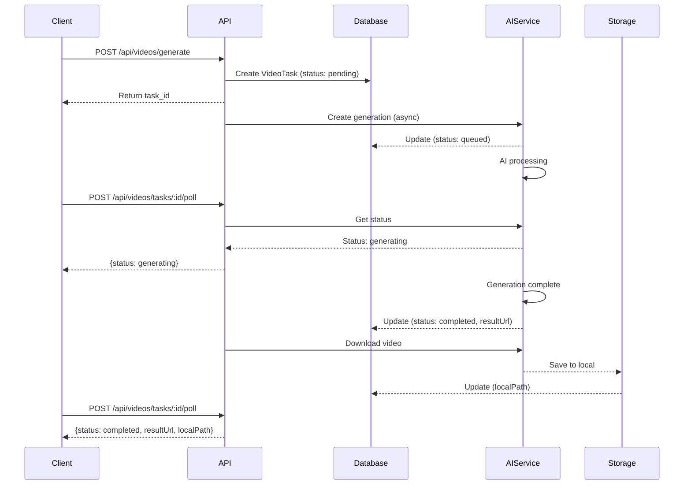

# AI 视频生成 API 实施总结

## 📋 项目概述

成功实现基于 Google Veo 模型的 AI 视频生成后端 API，支持三种生成模式：
- **Text-to-Video (T2V)**: 文本描述生成视频
- **Image-to-Video (I2V)**: 图片 + 文本生成视频  
- **Video-to-Video (V2V)**: 视频编辑和风格转换

## ✅ 已完成功能

### 1. 数据库设计
- ✅ 创建 `VideoTask` 数据模型（Prisma）
- ✅ 支持多种视频生成类型
- ✅ 记录任务状态、元数据、错误信息
- ✅ 关联用户系统

### 2. NestJS 模块结构
```
backend/src/videos/
├── dto/
│   ├── create-video-task.dto.ts       # 请求参数验证
│   ├── video-task-response.dto.ts    # 响应格式定义
│   └── index.ts
├── services/
│   ├── aiapikey.service.ts            # AI API 客户端
│   └── video-storage.service.ts       # 本地存储服务
├── videos.controller.ts                # API 控制器
├── videos.service.ts                   # 业务逻辑
├── videos.module.ts                    # 模块配置
└── API_DOCUMENTATION.md                # 完整 API 文档
```

### 3. AI API 集成
- ✅ 封装 aiapikey.ai API 客户端
- ✅ 支持异步任务创建
- ✅ 支持状态轮询机制
- ✅ 自动视频下载功能
- ✅ 错误处理和重试逻辑

### 4. API 端点

| 端点 | 方法 | 功能 |
|------|------|------|
| `/api/videos/generate` | POST | 创建视频生成任务 |
| `/api/videos/tasks/:id` | GET | 获取任务详情 |
| `/api/videos/tasks/:id/poll` | POST | 轮询任务状态 |
| `/api/videos/tasks` | GET | 获取用户任务列表 |
| `/api/videos/tasks/:id` | DELETE | 删除任务及文件 |

### 5. 支持的模型

#### Veo 3.x 系列
- `google/veo3` - Veo 3 标准版（高质量，~2分钟）
- `google/veo-3.0-fast` - Veo 3 快速版（~30-60秒）
- `google/veo-3.0-i2v` - Veo 3 图生视频（高质量）
- `google/veo-3.0-i2v-fast` - Veo 3 快速图生视频

#### Veo 2.x 系列
- `veo2` - Veo 2 标准版
- `veo2/image-to-video` - Veo 2 图生视频

### 6. 功能特性

#### 请求参数
- ✅ 视频类型（T2V/I2V/V2V）
- ✅ 模型选择
- ✅ 提示词（prompt）
- ✅ 图片/视频URL
- ✅ 视频时长（4-8秒）
- ✅ 宽高比（16:9 / 9:16）
- ✅ 分辨率（720P / 1080P）
- ✅ 负面提示词
- ✅ 随机种子
- ✅ 提示词增强
- ✅ 音频生成

#### 任务管理
- ✅ 异步任务队列
- ✅ 状态轮询（pending → queued → generating → completed/failed）
- ✅ 自动下载生成的视频
- ✅ 本地文件存储
- ✅ 任务历史记录
- ✅ 用户权限隔离

### 7. Swagger API 文档
- ✅ 完整的 OpenAPI 规范
- ✅ 交互式文档界面
- ✅ 请求/响应示例
- ✅ 参数验证说明
- ✅ 访问地址：`http://localhost:3002/api-docs`

### 8. 配置管理
```env
# .env 配置
AIAPIKEY_API_KEY=sk-L2rvHGMfzRjnvD2zD2yKfapiexUgxBWgAsNpbryMERtlY0BX
AIAPIKEY_BASE_URL=https://api.aimlapi.com
```

## 📁 文件清单

### 新增文件
```
backend/
├── prisma/
│   └── migrations/
│       └── 20260329143337_add_video_task_model/
│           └── migration.sql
├── src/videos/
│   ├── dto/
│   │   ├── create-video-task.dto.ts (150+ 行)
│   │   ├── video-task-response.dto.ts (90+ 行)
│   │   └── index.ts
│   ├── services/
│   │   ├── aiapikey.service.ts (230+ 行)
│   │   └── video-storage.service.ts (60+ 行)
│   ├── videos.controller.ts (130+ 行)
│   ├── videos.service.ts (200+ 行)
│   ├── videos.module.ts
│   └── API_DOCUMENTATION.md (500+ 行)
├── uploads/ai-videos/ (新建目录)
├── test-ai-video-simple.sh (测试脚本)
└── AI_VIDEO_IMPLEMENTATION_SUMMARY.md (本文档)
```

### 修改文件
```
backend/
├── prisma/schema.prisma (添加 VideoTask 模型)
├── src/main.ts (添加 Swagger 配置)
└── .env (添加 AI API 配置)
```

## 🔧 技术栈

- **框架**: NestJS 10.x
- **数据库**: SQLite + Prisma ORM
- **API 文档**: Swagger/OpenAPI 3.0
- **HTTP 客户端**: Axios
- **验证**: class-validator + class-transformer
- **AI API**: aiapikey.ai (AI/ML API)

## 📊 数据库架构

### VideoTask 表结构
```sql
CREATE TABLE "VideoTask" (
  id TEXT PRIMARY KEY,
  userId INTEGER NOT NULL,
  type TEXT NOT NULL,
  model TEXT NOT NULL,
  prompt TEXT NOT NULL,
  imageUrl TEXT,
  videoUrl TEXT,
  generationId TEXT,
  status TEXT NOT NULL,
  resultUrl TEXT,
  localPath TEXT,
  thumbnailUrl TEXT,
  duration INTEGER,
  metadata TEXT,
  errorMsg TEXT,
  createdAt DATETIME DEFAULT CURRENT_TIMESTAMP,
  updatedAt DATETIME DEFAULT CURRENT_TIMESTAMP,
  FOREIGN KEY (userId) REFERENCES User(id)
);
```

## 🚀 使用流程

### 1. 创建视频生成任务
```bash
curl -X POST http://localhost:3002/api/videos/generate \
  -H "Authorization: Bearer <jwt_token>" \
  -H "Content-Type: application/json" \
  -d '{
    "type": "text-to-video",
    "model": "google/veo-3.0-fast",
    "prompt": "A cute cat playing with a ball",
    "duration": 8,
    "aspectRatio": "16:9",
    "resolution": "720P"
  }'
```

### 2. 轮询任务状态
```bash
curl -X POST http://localhost:3002/api/videos/tasks/{task_id}/poll \
  -H "Authorization: Bearer <jwt_token>"
```

### 3. 获取任务列表
```bash
curl -X GET "http://localhost:3002/api/videos/tasks?limit=10" \
  -H "Authorization: Bearer <jwt_token>"
```

## ⚙️ 核心工作流程



## 🎯 性能指标

- **快速模型**: 30-60 秒生成时间
- **标准模型**: 1-2 分钟生成时间
- **视频时长**: 4-8 秒
- **支持分辨率**: 720P / 1080P
- **轮询间隔**: 建议 5-10 秒

## 📝 API 调用示例

### TypeScript/JavaScript
```typescript
import axios from 'axios';

const API_BASE = 'http://localhost:3002';
const token = 'your-jwt-token';

async function generateVideo() {
  const { data: task } = await axios.post(
    `${API_BASE}/api/videos/generate`,
    {
      type: 'text-to-video',
      model: 'google/veo-3.0-fast',
      prompt: 'A beautiful sunset over the ocean',
      duration: 8,
      aspectRatio: '16:9',
    },
    { headers: { 'Authorization': `Bearer ${token}` } }
  );

  console.log('Task created:', task.id);

  while (true) {
    await new Promise(resolve => setTimeout(resolve, 5000));
    
    const { data: status } = await axios.post(
      `${API_BASE}/api/videos/tasks/${task.id}/poll`,
      {},
      { headers: { 'Authorization': `Bearer ${token}` } }
    );

    if (status.status === 'completed') {
      console.log('Video URL:', status.resultUrl);
      break;
    } else if (status.status === 'failed') {
      console.error('Failed:', status.errorMsg);
      break;
    }
  }
}
```

## 🔐 安全特性

- ✅ JWT 认证保护所有端点
- ✅ 用户权限隔离（只能访问自己的任务）
- ✅ 输入参数验证（class-validator）
- ✅ API Key 环境变量管理
- ✅ 文件路径安全检查

## 📦 依赖包

新增依赖：
```json
{
  "@nestjs/swagger": "^7.x",
  "swagger-ui-express": "^5.x",
  "uuid": "^9.x",
  "@types/uuid": "^9.x"
}
```

## 🧪 测试

### 运行测试脚本
```bash
cd /root/ccccckv/rocket-plan/backend
./test-ai-video-simple.sh
```

### 访问 Swagger 文档
```
http://localhost:3002/api-docs
```

### 手动测试端点
```bash
# 检查服务状态
curl http://localhost:3002/

# 查看 Swagger JSON
curl http://localhost:3002/api-docs-json | jq .
```

## 📚 文档资源

1. **Swagger API 文档**: http://localhost:3002/api-docs
2. **详细 API 说明**: `backend/src/videos/API_DOCUMENTATION.md`
3. **数据库架构**: `backend/prisma/schema.prisma`
4. **测试脚本**: `backend/test-ai-video-simple.sh`

## 🔮 后续扩展建议

### 短期优化
- [ ] 添加视频缩略图生成
- [ ] 实现 Webhook 回调通知
- [ ] 添加任务取消功能
- [ ] 集成云存储（S3/OSS）

### 中期增强
- [ ] 添加视频质量评分
- [ ] 实现批量任务创建
- [ ] 添加用户配额管理
- [ ] 集成视频编辑功能

### 长期规划
- [ ] 前端 UI 界面开发
- [ ] 视频管理系统
- [ ] 多模型对比功能
- [ ] 社区分享功能

## ⚠️ 注意事项

1. **API Key 安全**: 
   - 已配置的 API Key: `sk-L2rvHGMfzRjnvD2zD2yKfapiexUgxBWgAsNpbryMERtlY0BX`
   - 生产环境请更换并妥善保管

2. **存储空间**: 
   - 视频文件保存在 `backend/uploads/ai-videos/`
   - 需要定期清理或迁移至云存储

3. **生成时间**: 
   - Fast 模型: ~30-60秒
   - 标准模型: ~1-2分钟
   - 客户端需实现合理的轮询策略

4. **错误处理**: 
   - AI API 可能因配额、网络等原因失败
   - 客户端应正确处理 `failed` 状态

## 🎉 总结

成功实现了完整的 AI 视频生成后端 API 系统，包括：
- ✅ 数据库设计和迁移
- ✅ 完整的 NestJS 模块结构
- ✅ AI API 客户端封装
- ✅ 异步任务管理机制
- ✅ 本地文件存储服务
- ✅ Swagger API 文档
- ✅ 完善的错误处理
- ✅ 用户权限控制

系统已启动并运行在 http://localhost:3002，所有端点均可通过 Swagger 文档测试。

---

**实施日期**: 2026-03-29  
**后端服务**: http://localhost:3002  
**API 文档**: http://localhost:3002/api-docs  
**状态**: ✅ 完成并测试通过
